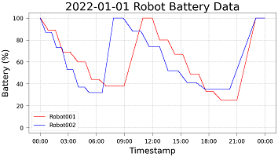
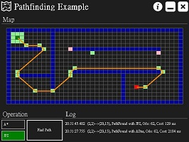
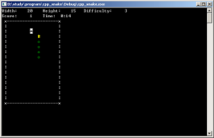
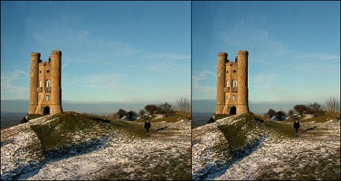
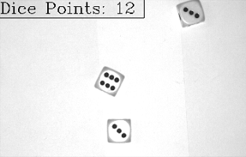
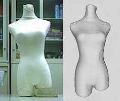

# 程式與碩士論文

+ [程式 歷史電量數據分析](#程式-歷史電量數據分析)
+ [程式 路徑搜尋演算法實作](#程式-路徑搜尋演算法實作)
+ [程式 貪吃蛇](#程式-貪吃蛇)
+ [程式 Seam Carving 演算法實作](#程式-seam-carving-演算法實作)
+ [程式 骰子點數計算](#程式-骰子點數計算)
+ [碩士論文 KinFu 應用於逆向工程之演算法研究](#碩士論文-kinfu-應用於逆向工程之演算法研究)

## 程式 歷史電量數據分析

在使用機器人時，使用者可記錄歷史電量資訊，並根據其計算機器人工作效能、電池健康度等資訊。此程式為自行產生隨機電量資料並使用該資料繪製電量折線圖。

相關技術： `Data Analysis`, `Python`, `Matplotlib`

[程式碼與更多資訊請點此 (Github)](battery-data-analysis/)

## 程式 路徑搜尋演算法實作

在半導體產業中，隨著自動化的普及，自走車應用在搬運機器人上的需求與日俱增。在自走車系統中除了 `SLAM` 技術外，路徑規劃技術亦是重要的一環。此程式實作現在最常使用的 `A Star` 與 `Jump Point Search` 演算法，並比較兩者的運算過程、運算速度。

相關技術： `Pathfinding`, `A Star`, `Jump Point Search`, `C#`, `Winform`

[程式碼與更多資訊請點此 (Github)](pathfinding/)

## 程式 貪吃蛇

經典的貪吃蛇遊戲。程式截圖如下，其中，黃色井字為蛇頭，綠色圓圈為蛇身，反白米字為食物，使用 W (上)、 A (左)、 S (下)、 D (右)進行移動控制。

相關技術： `C++`

[程式碼與更多資訊請點此 (Github)](snake-game/)

## 程式 Seam Carving 演算法實作

在調整圖片大小時，如果直接使用縮放的方式去單獨修改長或寬時，會導致圖片上的物件變形、比例失真。而 `Seam Carving` 演算法可以避免此情況，他是透過移除/新增圖片的接縫來調整圖片大小。

相關技術： `Image Processing`, `Seam Carving`, `C++`

[程式碼與更多資訊請點此 (Github)](seam-carving/)

## 程式 骰子點數計算

使用二值化分割圖片資訊，再使用膨脹 (Dilation) 與侵蝕 (Erosion) 去除雜訊及加強點數資訊，最後使用尋找輪廓 (Find Contour) 方法來計算骰子點數。

相關技術： `Image Processing`, `C++`, `OpenCV`

[程式碼與更多資訊請點此 (Github)](calculate-dice-point/)

## 碩士論文 KinFu 應用於逆向工程之演算法研究

現在可以透過使用深度感測器掃描、量測一個現有的實體，從而去重建出該實體的模型檔，而這種產生模型檔的方法即為逆向工程的一種。此論文主要為探討現有的開源函式庫 PCL (Point Cloud Library) 的 KinFu (Kinect Fusion) 方法於重建 3D 模型的流程與演算法。

另外為了得知透過 KinFu 方法法所重建出的物體模型的準確度，我們會再進行重建後模型精度實驗。我們選擇對形狀簡單的物體進行重建，因其物體較易量測尺寸，並比較 3D 模型與實體的尺寸差異。但實驗結果是產學計畫中較機密的部分，故無放進論文內。

相關技術： `Reverse Engineering`, `C++`, `PCL`, `KinFu`

[論文全文請點此 (Google 雲端硬碟)](https://drive.google.com/file/d/0BxAN2KHG8uF2dElOUjNEczhKQXc/view?usp=sharing)
