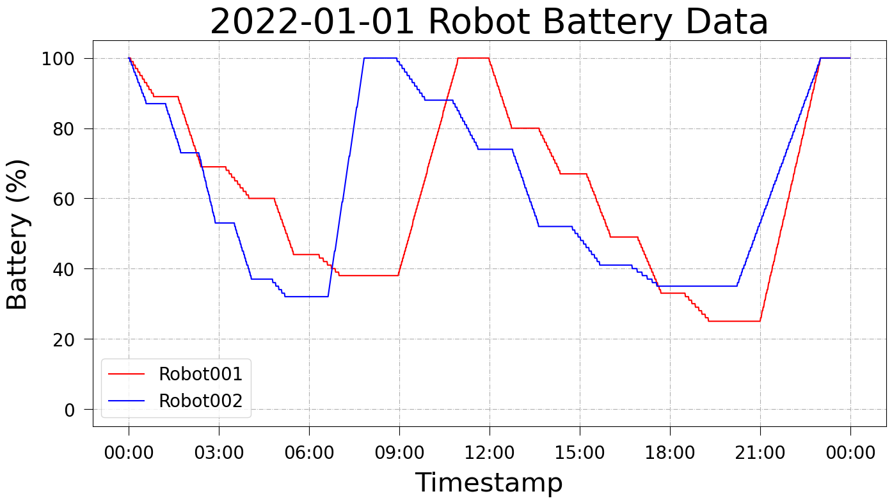

# Battery Data Analysis

在使用機器人時，使用者可記錄歷史電量資訊，並根據其計算機器人工作效能、電池健康度等資訊。

此程式為自行產生隨機電量資料並使用該資料繪製電量折線圖。 X 軸為時間戳記， Y 軸為電量 (%) ，繪製兩個機器人的電量曲線。

## 範例

## 參考資料

[Battery Mix (電池配置)](https://play.google.com/store/apps/details?id=jp.smapho.battery_mix&hl=zh_TW&gl=US)
