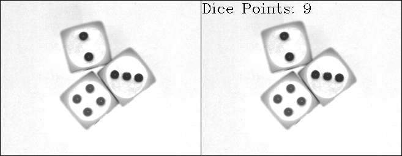
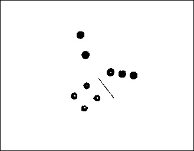
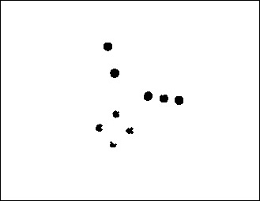
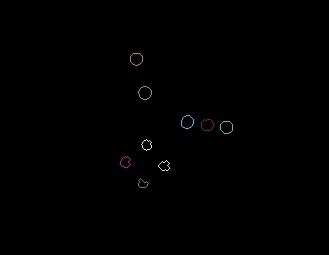
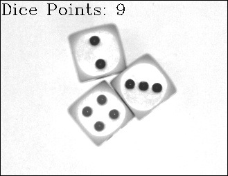
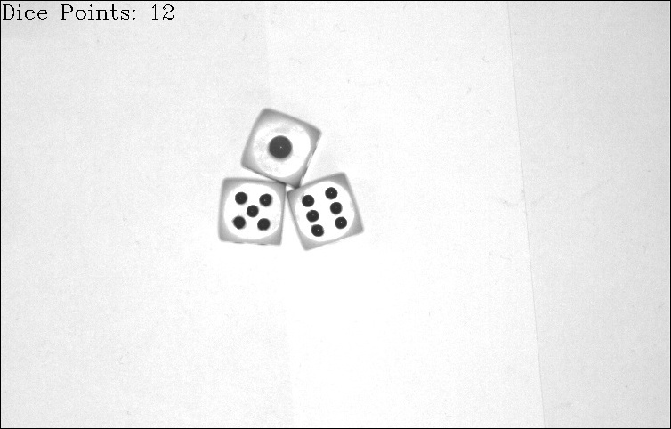
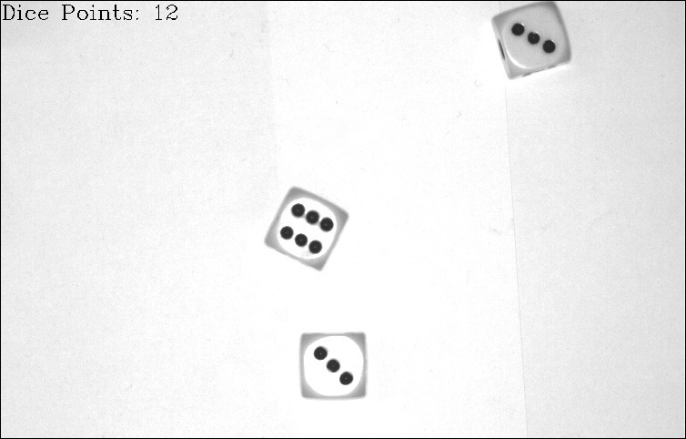
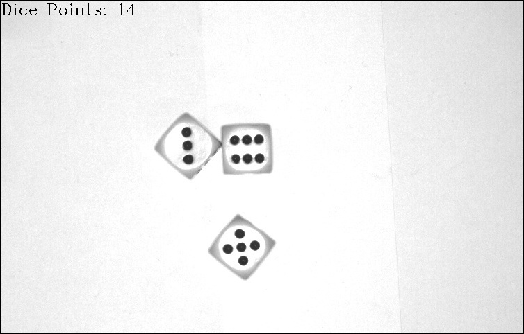
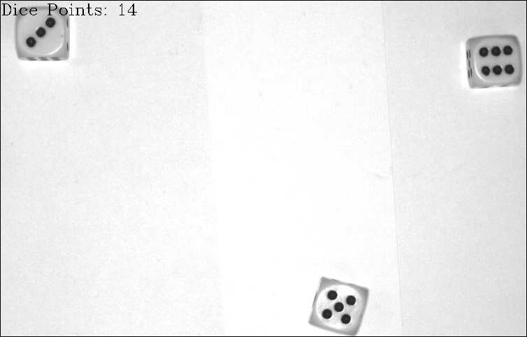

# 骰子點數計算

此為課堂的學習成果，亦是練習使用 OpenCV 函式庫，此程式中所有用到的演算法(二值化、侵蝕、膨脹、尋找輪廓)皆為 OpenCV 函式庫內的函式。

投擲三顆骰子後，用相機拍攝骰子，並輸出成圖片，程式讀取該圖片自動計算出骰子點數總和，並將骰子點數總和印在圖片上。結果下圖，左為原圖，右為程式計算後圖。

## 演算法流程

### 使用二值化分割圖片資訊

首先，我們只需要骰子點數的資訊，選擇使用二值化 (Binarization) 將骰子點數分離出來，我們使用的二值化閾值 (Threshold) 為 91 ，其處理後效果如下圖。

在閾值的選擇上，因為我們是在固定的環境下拍攝，拍攝地點、相機位置、背景、燈光強度皆是不變的，所以我們先拍攝數張骰子照片，再搭配 OpenCV 的 trackbar 功能，去對每張照片嘗試每一個閾值，藉此找出能把骰子點數分離出來的閾值，最後選擇二值化閾值為 91 。

### 使用膨脹與侵蝕來去除雜訊與加強點數資訊

雖然分離出了骰子點數，但仍有部分的雜點，以及骰子點數有中空的狀況，所以再搭配使用膨脹 (Dilation) 與侵蝕 (Erodsion) 來去除不需要的資訊及加強點數的資訊，處理後效果如下圖。

### 使用尋找輪廓方法

現在有較完整的骰子資訊，接著找出每一個點數的輪廓 (Contour) ，結果如下圖。

### 計算骰子總合

理論上，找到的輪廓數目總和，即是我們的點數總和。但經過上述的處理後，仍有可能會有雜點的資訊沒有去除，所以並不是找到的每一個輪廓都是骰子的點數，所以我們再從輪廓的大小進一步篩選，我們僅保留大小介於 8 到 50 的輪廓，然後計算找到的輪廓數目，即是骰子點數總和，再將其印到照片上，如下圖。

此處輪廓大小的閾值的選擇，一樣是先拍攝多張照片後，對每張照片去嘗試各個閾值，藉此找出合適的閾值。

## 其他實例

以下為判斷其他骰子點數的狀況。

