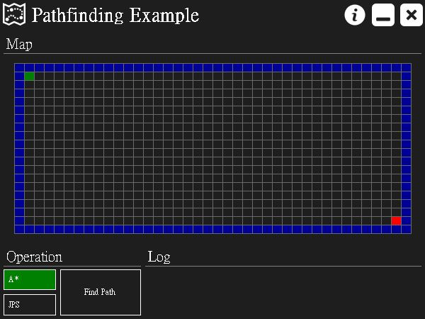
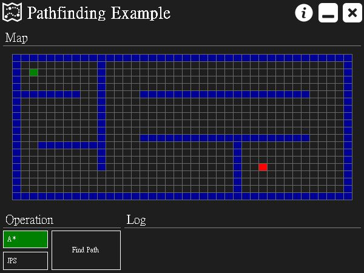
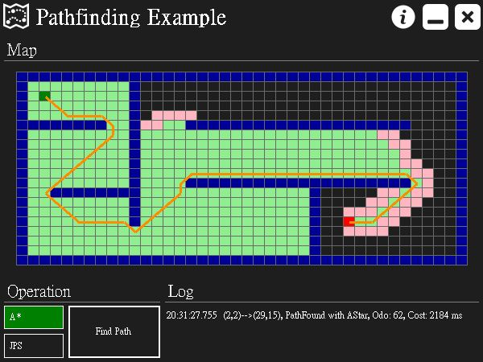
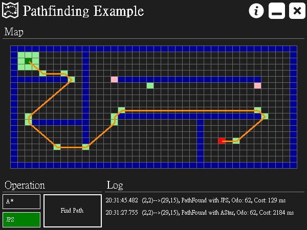

# 路徑搜尋

[Demo 影片請點此](https://drive.google.com/file/d/13VYFHiybsRWmLSmPJezsxlPZPC8kJAjE/view?usp=sharing)

實作時下常見的路徑搜尋演算法， A Star 與 Jump Point Search ，並透過介面顯示運作過程，以讓自身更了解並比較兩者演算法的差異。

## 程式簡介

程式開啟後的畫面如下圖，主要有地圖 (Map) 、運算 (Operation) 、歷史訊息 (Log) 三個區塊。在地圖中，藍色方格為障礙物，綠色方格為路徑起點，紅色方格為路徑終點。使用滑鼠點擊地圖空白處/障礙物可以新增/移除障礙物，使用滑鼠點擊並拖曳綠色/紅色方格來設定路徑的起點/終點。

可以於地圖自行繪製障礙物，繪製後的畫面如下圖。

繪製完成後，點選 A\* 或 JPS 按鈕來選擇要使用的演算法，點選 Find Path 按鈕來開始進行路徑搜尋運算。其中淺綠色方格為 Close Node (探索過的點)，淺紅色方格為 Open Node (尚未探索的點)，橘色的線條為計算出來的路徑線。

使用 A\* 演算法的結果如下圖。

使用 Jump Point Search 演算法的結果如下圖。

## 演算法比較

上述結果為，使用 A\* 演算法所得的路徑長度為 62 ，花費時間為 2184 毫秒 (ms) ，使用 Jump Point Search 演算法所得的路徑長度為 62 ，花費時間為 129 毫秒 (ms) 。比較後可得知，在此類型地圖下，兩者演算法所得的路徑幾乎相同，但 Jump Point Search 演算法所花的時間明顯比較少。若是在要求運算速度快速的場合下， Jump Point Search 演算法較為適合。

# 參考資料

+ [A*路徑搜尋初探 GameDev.net](https://swf.com.tw/?p=67)
+ [Jump Point Search](https://harablog.wordpress.com/2011/09/07/jump-point-search/)
